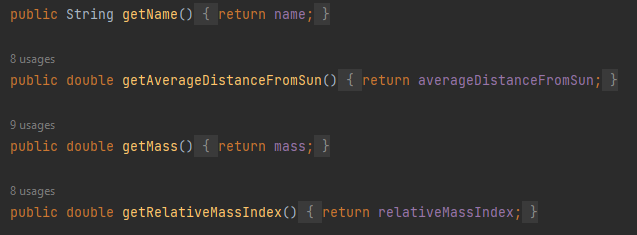
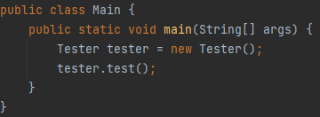

# Planet Enum
## Planet

Each plant has the above values for the various fields.

All variables are private and final.

Created constructor

Created getters for each basic variable

Created a get weight method that takes in a user input.

Created method that takes in a user input of a valid planet and return a string containing all the basic information about that planet.
converts the user's input to lowercase so that it is nto case sensitive.
added a default incase a valid input is not given.

## Main

Main runs the test method from Tester class

## Tester

Tester class utilises the method inside of the planet enum, it also takes in user input and has print statement requesting different information.

## MainTest

The MainTest class tests the code.